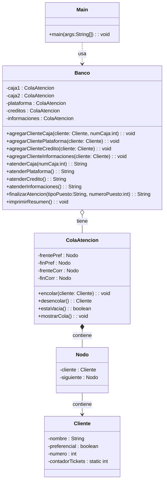

# Trabajo de Competencia: Ticktes para banco
**INDICE**

- [Trabajo de Competencia: Ticktes para banco](#trabajo-de-competencia-ticktes-para-banco)
  - [1. Configuracion de entorno](#1-configuracion-de-entorno)
  - [VS Code, Git, GitHub, Java](#vs-code-git-github-java)
    - [1.1 Instalacion VS Code](#11-instalacion-vs-code)
    - [1.2. Instalacion de Git](#12-instalacion-de-git)
    - [1.3. Instalacion Java](#13-instalacion-java)
    - [1.4. Configuracion Git y clave SSH](#14-configuracion-git-y-clave-ssh)
      - [1.4.1. Generar y agregar clave SSH a GitHub](#141-generar-y-agregar-clave-ssh-a-github)
    - [1.5. Clonar un repositorio de GitHub](#15-clonar-un-repositorio-de-github)
    - [1.6. Crear y cambiar de rama](#16-crear-y-cambiar-de-rama)
    - [1.7. Crear y ejecutar un proyecto en C#](#17-crear-y-ejecutar-un-proyecto-en-c)
    - [1.8. Subir cambios a GitHub](#18-subir-cambios-a-github)
  - [2. Desarrollo del proyecto](#2-desarrollo-del-proyecto)
  - [2.1. Estructura y convencion de nombres](#21-estructura-y-convencion-de-nombres)
  - [2.2. Diagrama de clases](#22-diagrama-de-clases)

## 1. Configuracion de entorno
## VS Code, Git, GitHub, Java

### 1.1 Instalacion VS Code

- Descarga VS Code: **[Download VS Code](https://code.visualstudio.com/download)**

- Instalar con la configuracion predeterminada
- Instalar extensiones:

  - **_Extension Pack for Java_**

---

### 1.2. Instalacion de Git

- Descarga Git: **[Download Git](https://git-scm.com/downloads)**
- Instalar con la configuracion predeterminada
- Prueba de version

---

```bash
git --version
```

---

### 1.3. Instalacion Java
* Primero verificamos si ya tenemos Java

---

```bash
 java --version
```
En caso de que no este instalado lo descargamos desde Oracle JDK, disponible para Windows, Linux y macOs

- Descarga Java: [Download Java](https://www.oracle.com/java/technologies/downloads/)

---

### 1.4. Configuracion Git y clave SSH

- Configuracion inicial Git

---

```bash
git config --global user.name "Tu nombre"

git config --global user.email "tu_correo@example.com"
```

---

Usa el mismo correo que tienes en **[GitHub](https://github.com/login)**

---

#### 1.4.1. Generar y agregar clave SSH a GitHub

- Generar clave SSH

---

```bash
ssh-keygen -t ed25519 -C "tu_correo_de_github@gmail.com"
```

---

- Levantar al agente SSH y agregar una clave

---

```bash
eval "$(ssh-agent -s)"
ssh-add ~/.ssh/id_ed25519
```

---

- Copiar la clave publica

---

```bash
cat ~/.ssh/id_ed25519.pub
```

---

**_¡¡¡Copia su contenido!!!_**

---

- Agregar la clave a GitHub

  - Ir a **[GitHub → Settings → SSH and GPG keys](https://github.com/settings/keys)**
  - Click en **New SSH key** y pega el contenido y guardalo

### 1.5. Clonar un repositorio de GitHub

- Crea una carpeta para clonar ahi tu repositorio

---

```bash
mkdir "nombre_de_tu_carpeta"
cd nombre_de_tu_carpeta
```

---

- Clonar un repositorio

---

```bash
git clone git@github.com:usuario/repositorio.git

cd repositorio
```

---

### 1.6. Crear y cambiar de rama

- Crear una rama
  ***

```bash
 git branch nombre_de_la_rama
```

---

- Crear una rama y cambiarte a ella

---

```bash
git checkout -b nombre_rama
```

---

- Cambiarte a la nueva rama

---

```bash
git checkout nombre_rama
```

---

### 1.7. Crear y ejecutar un proyecto en C#

- Crear una carpeta que vaya a contener el proyecto
- Abre desde la terminal
- En la terminal:

  - `dotnet new console`

- Para ejecutar:

  - `dotnet run`

### 1.8. Subir cambios a GitHub

- Ver estado

---

```bash
git status
```

- Agregar todos los cambios

---

```bash
git add .
```

- Crear un commit

---

```bash
git commit -m "mensaje con los cambios realizados"
```

---

- Subir los cambios a GitHub

---

```bash
git push
```

---

## 2. Desarrollo del proyecto
## 2.1. Estructura y convencion de nombres
* Estructura
```bash
Trabajo_Competencias/
│
├── SistemaBanco/            # Proyecto en Java
│   ├── Banco.java              
│   ├── Cliente.java            
│   ├── Estructuras.java          
│   ├── Main.java       
│   └── Nodo.java 
│
└── README.md                 #Documentacion
```
* Convencion de nombre
    * Archivos: PascalCase
    * Clases y Metodos: PascalCase
    * Atributos y Parametros:camelCase
      
## 2.2. Diagrama de clases
